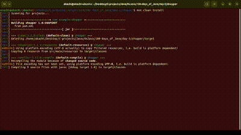

# THINGS I LEARNED IN DAY 5

1. HashMaps
2. HashSets
3. File IO
4. Object Serialization
5. Iterator
6. Lambda expression
7. Exceptions
8. Regex
9. Comparator
10. Comparable
11. Project setup with MAVEN

# TASK

Create user management app

**Requirements** - user CRUD

**Ensure you have the JAVA and MAVEN installed on your PC**
Then clone this repo.

